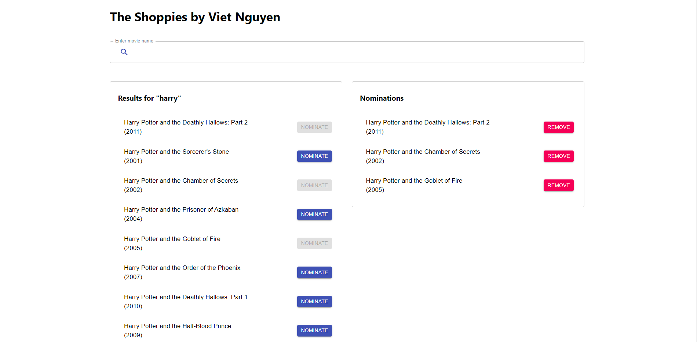

# The Shoppies - Shopify Front-end challenge

## About The Project

Shopify has branched out into movie award shows. This app is built to help manage movie nominations for the upcoming Shoppies.

You could see the live demo of this project [here](https://reverent-banach-beb88d.netlify.app/).



### The Challenge:

We need a webpage that can search OMDB for movies, and allow the user to save their favourite films they feel should be up for nomination. When they've selected 5 nominees they should be notified they're finished.

We'd like a simple to use interface that makes it easy to:

-   Search OMDB and display the results (movies only)
-   Add a movie from the search results to our nomination list
-   View the list of films already nominated
-   Remove a nominee from the nomination list

### Technical requirements

1. Search results should come from OMDB's API (free API key: http://www.omdbapi.com/apikey.aspx).
2. Each search result should list at least its title, year of release and a button to nominate that film.
3. Updates to the search terms should update the result list
4. Movies in search results can be added and removed from the nomination list.
5. If a search result has already been nominated, disable its nominate button.
6. Display a banner when the user has 5 nominations.

## Built With

-   React.js, Material UI

<!-- GETTING STARTED -->

## Run project on local machine

### Prerequisites

-   Node.js: v12.16.1

-   npm

```sh
npm install npm@latest -g
```

### Installation

1. Clone the repo

```sh
git clone https://github.com/viet-quocnguyen/shopify_challenge.git
```

2. Install NPM packages

```sh
npm install
```

3. Start project locally

```sh
npm run start
```

<!-- LICENSE -->

## License

Distributed under the MIT License. See `LICENSE` for more information.
